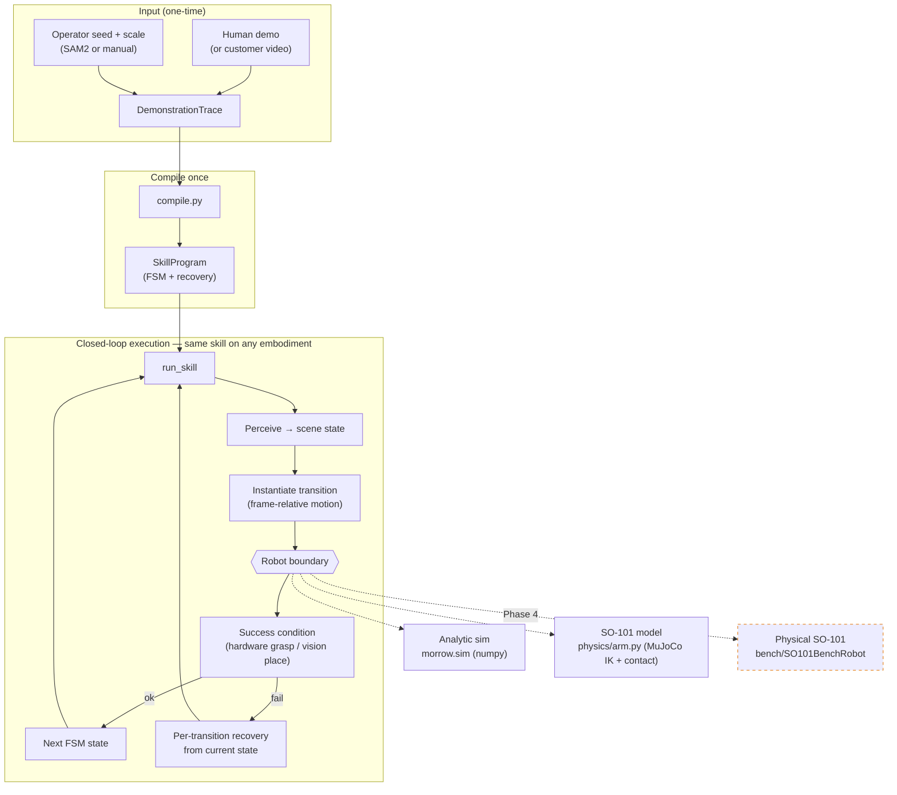

# morrow (mk3)

Demonstrate packing a product once. Morrow compiles that demonstration into a
**verified skill program** — a finite state machine that transfers to new
product and carton poses, recovers from failed grasps on its own, and takes a
new SKU without a line of code.

mk2 got demonstration → *understanding* (a checkable WorkflowSpec, no
execution). mk3 is the next capability: demonstration → *a runnable, verified
skill*, executed closed-loop against perception with per-transition recovery.

## The one idea

A `SkillProgram` is a **finite state machine**, not a list of phases:

```
READY → APPROACHED → GRASPED → LIFTED → OVER_CARTON → PLACED → RELEASED → VERIFIED
```

Every transition carries a frame-relative motion (learned from the demo), a
serializable success condition, a timeout, and its *own* recovery. Execution
re-perceives before every attempt, so recovery always runs from the robot's
actual current state — it never restarts a full skill from a physical state
that no longer matches `READY`. Grasp is verified by **hardware** (the
end-effector's grip signal — a vacuum seal or a parallel-jaw two-finger contact),
never by vision, because the tool occludes the product at exactly the moment you
need to confirm the grasp.

That FSM is the real IP. `compile.py` is where "the next SKU without code"
actually lives.

## What's real, and what's simulated

Two layers, one boundary:

- **Analytic core** (`morrow.sim`, numpy only — no physics engine, no GPU): the
  whole pipeline runs end to end, and it is what `morrow eval`'s frozen 100/88/0
  benchmark measures. It models a suction cell; the numbers show the *mechanism*
  (perception → hardware-verified grasp → per-transition recovery), **not**
  industrial reliability.
- **Physics + the SO-101 model** (`morrow.physics`, optional `[physics]` extra,
  MuJoCo): the *same* compiled skill runs against the LeRobot SO-101's real MJCF
  in MuJoCo — parallel-jaw contact grasp, tool-down IK — plus a SAM2 watch→pack
  path from real customer clips. This is the SO-101 **model**, not a physical arm.
  See **[PHASE3.md](PHASE3.md)**.

Hardware and perception are boundaries (`Robot`, `Perceiver`); sim and physics
implement them now, a **physical** SO-101 adapter (`bench/SO101BenchRobot`, a
scaffold today) implements them next. Nothing above the boundary knows the
difference — that is the whole point.

The grasp verdict is **end-effector-neutral**: `holding()` is a hardware signal
(vacuum seal in the analytic sim, two-finger contact on the parallel jaw), never
vision. The first physical arms are the standard LeRobot **parallel jaw**, not
suction.

## Architecture — one skill, every embodiment

Demonstrate (or watch) a packing skill once → compile it into a verified FSM with
recovery → run that *same* skill against the analytic sim, the MuJoCo SO-101
model, or (Phase 4) the physical arm, without rewriting code. The dashed node is
the only box that changes when hardware arrives.



## Numbers (from `morrow eval`)

Frozen benchmark, 100 randomized trials per class (product moved + fully
rotated, carton jittered, 12% grasp-slip noise):

| SKU class | onboarding | morrow final | first-attempt | human | open-loop replay |
|-----------|-----------|--------------|---------------|-------|------------------|
| box       | 2 demos, 0 code | 100% | 88% | 0% | 8% |
| cylinder  | 2 demos, 0 code | 100% | 88% | 0% | 8% |
| pouch     | 2 demos, 0 code | 100% | 88% | 0% | 4% |

"Open-loop replay" is the honest baseline: replay the demonstrated trajectory
taught-once, exactly like a fixed industrial cell. It collapses the moment the
product moves — which is the whole reason perception + a verified skill matter.

**The data flywheel.** Every run logs each grasp attempt (params + sealed/miss)
to a deterministic episode log (`journal.py`). A small opt-in ranker
(`ranker.py`) trains on that log. On a SKU whose seal reliability depends on
grasp yaw — a signal the analytic score structurally ignores — the learned
ranker lifts first-attempt success from ~52% to ~90% by picking the grasp that
actually seals. The analytic path stays the default; the ranker only adds a term
and never overrides the fail-closed gates. On the frictionless standard set it
is parity — the lift shows up exactly where grasp quality has structure, as it
does on real deformables.

## Usage

```bash
python -m pip install -e '.[dev]'

morrow onboard box            # compile a skill and print its state machine
morrow run pouch --seed 3     # run one randomized packing cycle, print the timeline
morrow eval --n 100           # the frozen benchmark
morrow eval --stress --log e.jsonl   # harder worlds; persist every episode
morrow eval --breakdown       # tally where the stress batch gets stuck, by edge
morrow ranker box             # A/B the learned grasp ranker on a structured SKU
morrow pack                   # pack one of each SKU into a single carton (high-mix)
morrow save box skill.json    # onboard and write the skill to JSON
morrow demo                   # analytic localhost dashboard at http://127.0.0.1:8000
morrow demo --shot demo.html  # render the dashboard to a file, no server
pytest                        # the suite (physics/CV tests skip without their extras)

# Physics + the SO-101 model + SAM2 (optional extra; see PHASE3.md)
python -m pip install -e '.[dev,physics]'
export MORROW_SAM2_CKPT=/path/to/sam2.1_hiera_tiny.pt   # for the watch pipeline
morrow cell                   # SO-101 MuJoCo dashboard at http://127.0.0.1:8001
morrow watch                  # watch a real clip with SAM2 → SO-101 physics pack
```

## The investor sequence

`morrow.pipeline.investor_sequence()` assembles the frozen demo as one
serializable object, and both the CLI and the dashboard render exactly it:

1. record a demo → show the compiled state graph
2. move product and carton → run successfully
3. force a grasp failure → show the recovery fire, from the current state
4. onboard a second SKU with no code → run it
5. show the frozen benchmark numbers

## Layout

```
src/morrow/
  geometry.py    SE(3) helpers (yaw-about-vertical regime)
  trace.py       DemonstrationTrace — the immutable demo contract
  scene.py       SceneState — mask/surface perception result (no rigid pose)
  skill.py       SkillState, Transition, SkillProgram — the verified FSM
  conditions.py  serializable success conditions (grasp = hardware, place = vision)
  compile.py     the demonstration compiler: trace -> SkillProgram  (highest-leverage)
  motion.py      instantiate one FSM edge into world waypoints from the current scene
  candidates.py  deterministic seeded candidates, fail-closed gates, ranking
  execute.py     run_skill: the state machine + bounded, from-current-state recovery
  conditions.py  serializable success conditions (grasp = hardware, place = vision)
  serialize.py   SkillProgram <-> JSON (content-addressed, no callables)
  journal.py     deterministic episode log — the data flywheel
  ranker.py      learned grasp-success ranker (opt-in, trained on the log)
  robot.py       Robot boundary (grasp verified by hardware signal)
  perceive.py    Perceiver boundary
  sequence.py    multi-object packing — several SKUs into one carton, in order
  pipeline.py    the investor sequence, assembled
  cli.py         `morrow`
  sim/           analytic tabletop world implementing the boundaries (suction cell)
  physics/       optional MuJoCo backend: SO-101 model (arm.py, IK + parallel-jaw
                 contact), SAM2 watch→pack (watch.py), activity profile, `morrow cell`
  bench/         physical SO-101 adapter scaffold (SO101BenchRobot) + BENCH.md + ACCEPTANCE.md
  eval/          frozen benchmark, metrics, open-loop replay baseline
  dashboard/     dependency-free localhost results page (DeepMind-ish)
tests/
PHASE3.md        reader's guide to the physics + CV + SO-101 stack
```

## Deliberately not here yet

- **Physical hardware** — the whole thing runs in the analytic sim and against the
  SO-101 *model* in MuJoCo, **not** a physical arm. Phase 4 wires a real LeRobot
  SO-101 follower behind `Robot` (`bench/SO101BenchRobot`, a scaffold today) with a
  fixed overhead camera behind `Perceiver`, and measures the sim-to-real gap. The
  `100/88/0` benchmark is analytic regression evidence, not physical reliability.
  Acceptance gates for the physical bench live in
  [`bench/ACCEPTANCE.md`](src/morrow/bench/ACCEPTANCE.md).
- **Bench perceiver** — real overhead RGB-D / calibrated table plane + SAM-class
  segmentation. The `Perceiver` boundary is ready for it.
- **Anything past packing** — kitting, mobile bases. Same FSM, later. High-mix
  *packing sequences* (several SKUs into one carton, in order, with auto-assigned
  slots and footprint-clearance checks so items don't land on each other) are
  here via `sequence.py`; clearance uses 2.5D footprint AABBs a bench would
  refine with real geometry.
